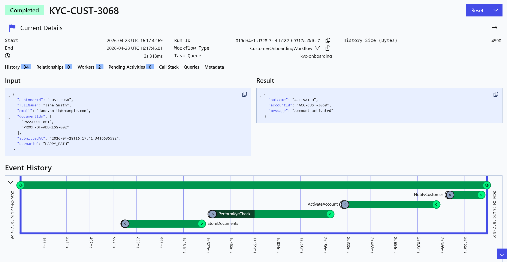

# temporal-kyc-sample
A Java sample demonstrating a **customer onboarding / Know Your Customer (KYC)** flow built on [Temporal](https://temporal.io/).

Customer onboarding can run for hours or days, depends on external checks and manual compliance review, and sometimes gets stuck. Temporal's durable execution model handles all of this natively.

---

## What it demonstrates

| Concern | How it's addressed |
|---|---|
| Long-running / can get stuck | Single workflow with a 30-day timer SLA; worker restarts are transparent |
| External KYC vendor check | Dedicated activity with heartbeat, exponential backoff, and `scheduleToClose` cap |
| Human-in-the-loop review | Temporal Durable Timers and Updates for compliance officer approval/rejection; validator rejects decisions sent in wrong workflow state |
| Audit trail | `logAuditEvent` activity writes to Postgres on every state transition |
| Operator visibility | Search attributes (`ApplicationStep`, `KycStatus`, `ReviewDeadline`) upserted at each step; queryable state via `getOnboardingState` |
| Idempotency | WorkflowId `KYC-<customerId>` prevents duplicate onboarding; `activateAccount` uses the input deterministic account ID to derive the customer ID, making retries safe  and idempotent|

 This is a demonstration of how Temporal addresses these concerns. Activities and endpoints are stubbed. See notes in [Activity integration points](#activity-integration-points) below for more information about productionalization.

---

## Workflow lifecycle

```
Application Submitted
        │
        ▼
  storeDocuments ──────────────────────────── [Document Store]
        │
        ▼
  performKycCheck ─────────────────────────── [KYC Vendor]
        │
   ┌────┴────┐────────────────────────┐
FAILED   NEEDS_MANUAL_REVIEW      PASSED
   │         │                        │
REJECTED  submitToComplianceQueue     │
          │                           │
          ▼                           │
   await(signal, 30 days)             │
          │                           │
     ┌────┴──────────────┐            │
  decision           (timeout)        │
     │                   │            │
     │          escalateReview        │
     │                   │            │
     │        await(signal, 7 days)   │
     │                   │            │
     │              ┌────┴────┐       │
     │           decision  (timeout)  │
     │              │         │       │
     │              │      REJECTED   │
     │              │                 │
     └──────────────┘                 │
          │                           │
     ┌────┴────┐                      │
  APPROVED  REJECTED              (merge)
     │         │                      │
     │      REJECTED                  │
     │                                │
     └──────────────────► activateAccount ── [Account Service]
                                      │
                                  ACTIVATED
```

## Temporal Workflow Visualization:

<p align="center">
  
</p>

---

## Project structure

```
temporal-kyc-sample/
├── build.gradle / settings.gradle / gradlew
├── gradle.properties              (points Gradle to Java 17 JDK)
├── core/
│   └── src/
│       ├── main/java/io/temporal/samples/kyc/
│       │   ├── KycWorker.java             — long-running worker process
│       │   ├── KycStarter.java            — starts a workflow execution
│       │   ├── KycApprover.java           — sends approval/rejection update
│       │   ├── KycConstants.java          — task queue name, workflow ID prefix
│       │   ├── workflow/
│       │   │   ├── CustomerOnboardingWorkflow.java      (interface)
│       │   │   └── CustomerOnboardingWorkflowImpl.java  (implementation)
│       │   ├── activities/
│       │   │   ├── OnboardingActivities.java            (interface)
│       │   │   └── OnboardingActivitiesImpl.java        (stub implementation)
│       │   └── model/
│       │       ├── ApplicationRequest.java
│       │       ├── ApplicationScenario.java  (enum: HAPPY_PATH, NEEDS_REVIEW, HARD_FAIL, …)
│       │       ├── ApplicationStatus.java
│       │       ├── ComplianceDecision.java
│       │       ├── KycResult.java / KycStatus.java
│       │       ├── OnboardingState.java      (query return type)
│       │       ├── OnboardingOutcome.java
│       └── test/java/io/temporal/samples/kyc/
│           └── CustomerOnboardingWorkflowTest.java
```

---

## Prerequisites

- Java 17+ JDK (`javac` on `PATH`)
- [Temporal CLI](https://docs.temporal.io/cli) (`temporal`)

---

## Configuration

The worker and starter read from environment variables:

| Variable | Default | Description |
|---|---|---|
| `TEMPORAL_ADDRESS` | `localhost:7233` | Temporal server gRPC endpoint |
| `TEMPORAL_NAMESPACE` | `default` | Namespace |
| `TEMPORAL_TASK_QUEUE` | `kyc-onboarding` | Task queue name |
| `SCENARIO` | `HAPPY_PATH` | Demo scenario (see below) |
| `DECISION` | `approve` | `approve` or `reject` (KycApprover) |
| `REVIEWER_ID` | `compliance-officer-1` | Reviewer identifier (KycApprover) |
| `REASON` | — | Rejection reason (KycApprover) |

For Temporal Cloud, also set `TEMPORAL_CERT_PATH` and `TEMPORAL_KEY_PATH`.

---

## Running locally

### 1. Start the Temporal dev server

```bash
temporal server start-dev
```

### 2. Register custom search attributes

```bash
temporal operator search-attribute create --name ApplicationStep  --type Keyword
temporal operator search-attribute create --name KycStatus        --type Keyword
temporal operator search-attribute create --name ReviewDeadline   --type Keyword
```

### 3. Start the worker

```bash
./gradlew -q execute -PmainClass=io.temporal.samples.kyc.KycWorker
```

### 4. Run a workflow

```bash
# Happy path — KYC passes, account activated immediately
./gradlew -q execute -PmainClass=io.temporal.samples.kyc.KycStarter

# KYC flags for manual review (workflow pauses, waiting for signal)
SCENARIO=NEEDS_REVIEW ./gradlew -q execute -PmainClass=io.temporal.samples.kyc.KycStarter

# KYC hard rejection — workflow ends as REJECTED
SCENARIO=HARD_FAIL ./gradlew -q execute -PmainClass=io.temporal.samples.kyc.KycStarter

# KYC vendor times out 4 times before succeeding (watch retries in the UI)
SCENARIO=API_DOWNTIME ./gradlew -q execute -PmainClass=io.temporal.samples.kyc.KycStarter
```

The starter prints the `workflowId` (`KYC-CUST-XXXX`). Open `http://localhost:8233` to watch progress in the Temporal UI.

---

## Human-in-the-loop: approving / rejecting a review

When a workflow is in `MANUAL_REVIEW_PENDING`, a compliance officer delivers a decision.

### Approve/Reject Via Update

Updates are synchronous: the call blocks until the workflow handler runs and returns. The update validator will validate these events and reject the request if the workflow is not yet in `MANUAL_REVIEW_PENDING` or `REVIEW_TIMEOUT`.

```bash
# Approve
./gradlew -q execute -PmainClass=io.temporal.samples.kyc.KycApprover -Parg=KYC-CUST-1234

# Reject
DECISION=reject REASON="Incomplete documentation" \
  ./gradlew -q execute -PmainClass=io.temporal.samples.kyc.KycApprover -Parg=KYC-CUST-1234
```

Or directly with the Temporal CLI:

```bash
temporal workflow update \
  --workflow-id KYC-CUST-1234 \
  --name approveApplication \
  --input '"reviewer-001"'
```

---

## Querying workflow state

```bash
temporal workflow query \
  --workflow-id KYC-CUST-1234 \
  --type getOnboardingState
```

Returns the current `step`, `kycStatus`, `reviewDeadline`, and `progressPct`.

---

## Searching workflows by step

```bash
# All workflows currently in manual review
temporal workflow list --query 'ApplicationStep = "MANUAL_REVIEW_PENDING"'

# All workflows where KYC passed
temporal workflow list --query 'KycStatus = "PASSED"'
```


---

## Running tests

```bash
./gradlew :core:test
```

Six tests covering: happy path, manual review approved, manual review rejected, 30-day SLA timeout (clock fast-forwarded), and KYC hard fail.

---

## Activity integration points

Each activity method in `OnboardingActivitiesImpl` contains a `// IMPL-TO-DO:` comment marking where the real system call goes. To productionalize this application, start with those Implementation To Dos.

Activities with multiple parameters often use a single input object (e.g., `KycCheckInput`, `ActivateAccountInput`). This is intentional: Temporal serializes activity arguments positionally, so adding a new parameter to a flat signature is a breaking change for in-flight workflows. Adding a new field to an input object is backwards-compatible because Jackson ignores unknown fields during deserialization.

| Activity | Integration |
|---|---|
| `storeDocuments` | POST to document service API |
| `performKycCheck` | KYC vendor SDK / REST API; heartbeat every ~30s while polling |
| `submitToComplianceQueue` | `INSERT INTO compliance_tickets` (Postgres) |
| `escalateReview` | PagerDuty / compliance manager webhook |
| `activateAccount` | POST to account service with `Idempotency-Key` header |
| `logAuditEvent` | `INSERT INTO audit_events … ON CONFLICT DO NOTHING` (Postgres) |
| `notifyCustomer` | Email / SMS gateway |

